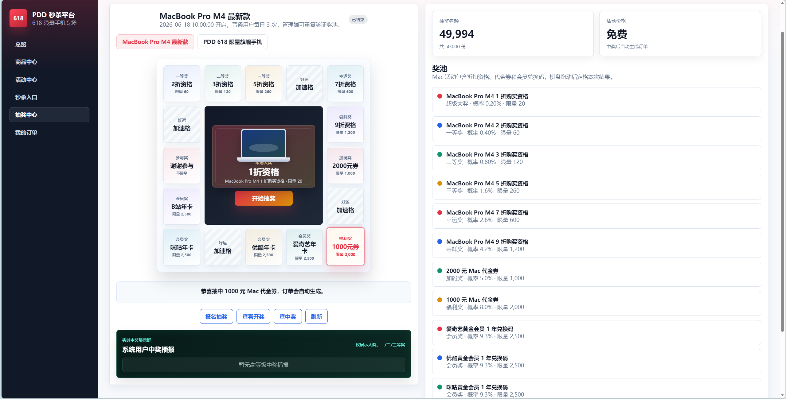

# PDD 618 秒杀与抽奖平台

本项目95%是基于codex+gpt-5.5辅助完成，但依然属于作者原创项目，主要目的是主流技术栈应用和AI coding能力的锻炼，该项目仅作为新手实操项目，距离真实业务平台功能还有待完善。 用户分为普通用户demo和管理员admin，admin抽奖可不受活动时间制约。

这是一个 Spring Cloud 微服务项目，模拟 618 手机大促：总库存 100000 台，其中 90000 台通过秒杀售卖，10000 台通过抽奖发放。项目覆盖网关鉴权、库存预热、Redis Lua 原子扣减、RabbitMQ 削峰异步下单、MyBatis-Plus 持久化、Nacos 注册发现、Docker Compose 本地环境和原生前端页面。

<div align="center">
  
</div>

## 技术栈

- Java 17, Spring Boot 3.2, Spring Cloud 2023, Spring Cloud Alibaba Nacos
- Spring Cloud Gateway, OpenFeign, MyBatis-Plus, MySQL 8
- Redis 7, Lua 脚本, RabbitMQ, Spring AMQP
- JWT 登录鉴权, Knife4j/OpenAPI, Docker Compose
- 原生 HTML/CSS/JavaScript 前端

## 目录说明

| 路径 | 主要功能 |
| --- | --- |
| `pdd-gateway` | API 网关服务，端口 `8080`，负责 JWT 校验、跨域配置和微服务路由转发。 |
| `pdd-auth-service` | 认证服务，端口 `8081`，负责用户注册、登录和 JWT 签发。 |
| `pdd-product-service` | 商品活动服务，端口 `8082`，负责商品列表、活动列表、数据库库存扣减和 Redis 库存预热。 |
| `pdd-order-service` | 订单服务，端口 `8083`，消费 RabbitMQ 下单消息，完成幂等建单和数据库落库。 |
| `pdd-seckill-service` | 秒杀服务，端口 `8084`，负责秒杀入口、Redis Lua 原子扣库存、一人一单校验和下单消息投递。 |
| `pdd-lottery-service` | 抽奖服务，端口 `8085`，负责抽奖轮盘、奖池概率、奖品库存限制、中奖查询和中奖订单投递。 |
| `pdd-common` | 公共模块，放通用返回体、异常处理、JWT 工具、用户上下文、Feign 客户端、MQ 常量、Redis key 常量等。 |
| `pdd-web` | 前端静态页面，包含活动列表、秒杀入口、抽奖轮盘、订单列表和演示操作。 |
| `sql` | 数据库初始化脚本，创建用户、商品、活动、订单表，并插入演示账号和活动数据。 |
| `scripts` | Windows PowerShell 辅助脚本，用于启动基础依赖、打包、启动/停止后端服务和启动静态前端。 |
| `docs` | API 示例和项目说明文档。 |
| `load-test` | 压测脚本，目前包含 k6 秒杀压测示例。 |
| `logs` | 脚本启动服务后的日志目录，由运行脚本自动创建。 |
| `.mvn` | Maven 本地配置，目前指定本地仓库路径为 `D:\Java\Maven`。 |
| `docker-compose.yml` | 本地基础依赖编排，包含 MySQL、Redis、RabbitMQ、Nacos。 |
| `pom.xml` | Maven 父工程，统一管理多模块、依赖版本和打包插件。 |

## 服务端口

| 服务 | 端口 |
| --- | --- |
| 网关 `pdd-gateway` | `8080` |
| 认证服务 `pdd-auth-service` | `8081` |
| 商品活动服务 `pdd-product-service` | `8082` |
| 订单服务 `pdd-order-service` | `8083` |
| 秒杀服务 `pdd-seckill-service` | `8084` |
| 抽奖服务 `pdd-lottery-service` | `8085` |
| MySQL Docker 映射端口 | `3307` |
| Redis | `6379` |
| RabbitMQ | `5672`, 管理台 `15672` |
| Nacos | `8848`, `9848` |

## 快速启动

前置环境：

- JDK 17
- Maven 3.8+
- Docker Desktop
- Windows PowerShell

进入项目根目录：

```powershell
cd D:\Java\projects\PDD_
```

打包后端服务：

```powershell
mvn clean package -DskipTests
```

如果只是重启服务，没有改代码，可以跳过 Maven 打包：

```powershell
docker compose up -d mysql redis rabbitmq nacos
powershell -ExecutionPolicy Bypass -File .\scripts\stop-services.ps1
powershell -ExecutionPolicy Bypass -File .\scripts\run-services.ps1
```

验证网关是否启动成功：

```powershell
curl http://localhost:8080/actuator/health
```

看到下面结果说明网关正常：

```json
{"status":"UP"}
```

打开浏览器访问：

```text
http://localhost:8080
```

默认账号：

```text
demo / 123456
admin / 123456
```

停止后端服务：

```powershell
powershell -ExecutionPolicy Bypass -File .\scripts\stop-services.ps1
```

停止 Docker 基础依赖：

```powershell
docker compose stop
```

## IDEA 启动方式

1. 用 IDEA 打开项目根目录 `D:\Java\projects\PDD_`。
2. Project SDK 选择 JDK 17。
3. 先在 IDEA Terminal 启动基础依赖：

```powershell
docker compose up -d mysql redis rabbitmq nacos
```

4. 分别创建 6 个 Spring Boot 运行配置：

| 配置名 | Main class |
| --- | --- |
| `pdd-auth-service` | `com.pdd.auth.AuthApplication` |
| `pdd-product-service` | `com.pdd.product.ProductApplication` |
| `pdd-order-service` | `com.pdd.order.OrderApplication` |
| `pdd-seckill-service` | `com.pdd.seckill.SeckillApplication` |
| `pdd-lottery-service` | `com.pdd.lottery.LotteryApplication` |
| `pdd-gateway` | `com.pdd.gateway.GatewayApplication` |

5. 每个运行配置都设置同一份环境变量：

```text
NACOS_ADDR=127.0.0.1:8848;MYSQL_HOST=127.0.0.1;MYSQL_PORT=3307;MYSQL_DATABASE=pdd_flash_sale;MYSQL_USER=root;MYSQL_PASSWORD=123456;REDIS_HOST=127.0.0.1;REDIS_PORT=6379;RABBITMQ_HOST=127.0.0.1;RABBITMQ_USER=pdd;RABBITMQ_PASSWORD=pdd123456
```

6. 按顺序启动：

```text
pdd-auth-service
pdd-product-service
pdd-order-service
pdd-seckill-service
pdd-lottery-service
pdd-gateway
```

注意：本项目 Docker MySQL 映射到本机 `3307`，不是 `3306`。如果环境变量漏掉 `MYSQL_PORT=3307`，服务可能会连到本机已有 MySQL，导致登录或活动接口异常。

## 常用地址

- 网关健康检查：http://localhost:8080/actuator/health
- Nacos 控制台：http://localhost:8848/nacos
- RabbitMQ 管理台：http://localhost:15672
- 前端页面：http://localhost:8080

RabbitMQ 默认账号：

```text
pdd / pdd123456
```

## 核心流程

秒杀链路：

1. 商品服务将 `SECKILL` 活动库存预热到 Redis。
2. 用户请求 `/api/seckill/grab`。
3. 秒杀服务执行 Lua 脚本，原子完成库存校验、扣减和一人一单校验。
4. 成功请求写入 RabbitMQ，接口立即返回排队结果。
5. 订单服务消费消息，用 `request_id` 幂等建单，并扣减 MySQL 活动库存。

抽奖链路：

1. 用户在前端抽奖轮盘点击抽奖。
2. 抽奖服务按奖池权重计算结果，并用 Redis 限制每个用户每场活动只能抽一次。
3. 一等奖最多 10 台 iPhone 17 Plus，二等奖最多 100 台红米 K100 Pro，三等奖最多 1000 张 1000 元代金券，超出库存自动落到参与奖。
4. 中奖后投递 RabbitMQ 订单消息，由订单服务异步生成订单。
5. 前端可在“我的订单”查看中奖订单。

## 奖池配置

手机轮盘奖池：

| 奖项 | 奖品 | 库存 | 概率 |
| --- | --- | --- | --- |
| 一等奖 | iPhone 17 Plus | 10 台 | 0.50% |
| 二等奖 | 红米 K100 Pro | 100 台 | 4.50% |
| 三等奖 | 1000 元代金券 | 1000 张 | 45.00% |
| 参与奖 | 参与奖 | 不限 | 50.00% |

Mac 棋盘奖池：

| 奖项 | 奖品 | 库存 | 概率 |
| --- | --- | --- | --- |
| 超级大奖 | MacBook Pro M4 1 折购买资格 | 20 份 | 0.20% |
| 一等奖 | MacBook Pro M4 2 折购买资格 | 60 份 | 0.40% |
| 二等奖 | MacBook Pro M4 3 折购买资格 | 120 份 | 0.80% |
| 三等奖 | MacBook Pro M4 5 折购买资格 | 260 份 | 1.60% |
| 幸运奖 | MacBook Pro M4 7 折购买资格 | 600 份 | 2.60% |
| 尝鲜奖 | MacBook Pro M4 9 折购买资格 | 1200 份 | 4.20% |
| 加码奖 | 2000 元 Mac 代金券 | 1000 张 | 5.00% |
| 福利奖 | 1000 元 Mac 代金券 | 2000 张 | 8.00% |
| 会员奖 | 爱奇艺黄金会员 1 年兑换码 | 2500 个 | 9.30% |
| 会员奖 | 优酷黄金会员 1 年兑换码 | 2500 个 | 9.30% |
| 会员奖 | 咪咕黄金会员 1 年兑换码 | 2500 个 | 9.30% |
| 会员奖 | bilibili 大会员 1 年兑换码 | 2500 个 | 9.30% |
| 参与奖 | 谢谢参与 | 不限 | 40.00% |

如数据库已经初始化过，可执行 `sql/update_lottery_weights.sql` 同步新权重。

## 常见问题

PowerShell 提示禁止运行脚本时，使用：

```powershell
powershell -ExecutionPolicy Bypass -File .\scripts\run-services.ps1
```

`mvn clean package` 删除 jar 失败时，通常是服务还在运行，先执行：

```powershell
powershell -ExecutionPolicy Bypass -File .\scripts\stop-services.ps1
```

直接通过浏览器访问 `http://localhost:8080` 即可使用完整的前端页面，无需再通过 `file://` 协议打开静态文件。

如果活动显示未开始，是因为初始化活动时间在 `sql/init.sql` 中，演示时可以把数据库里的 `pdd_activity.start_time` 和 `end_time` 调整到当前时间窗口。

## API 与压测

API 示例见：

```text
docs/api.http
```

k6 压测示例：

```powershell
$env:TOKEN = "登录接口返回的 token"
k6 run .\load-test\k6-seckill.js
```

## 可继续扩展

- 接入 Sentinel 做接口限流、熔断降级。
- 增加支付超时取消、订单状态机和延迟队列。
- 引入 Redisson 分布式锁管理开奖任务。
- 使用 XXL-JOB 替代本地定时任务，适配多实例部署。
- 增加 JMeter/Gatling 压测报告，展示 QPS、P99 延迟和 MQ 堆积恢复能力。
